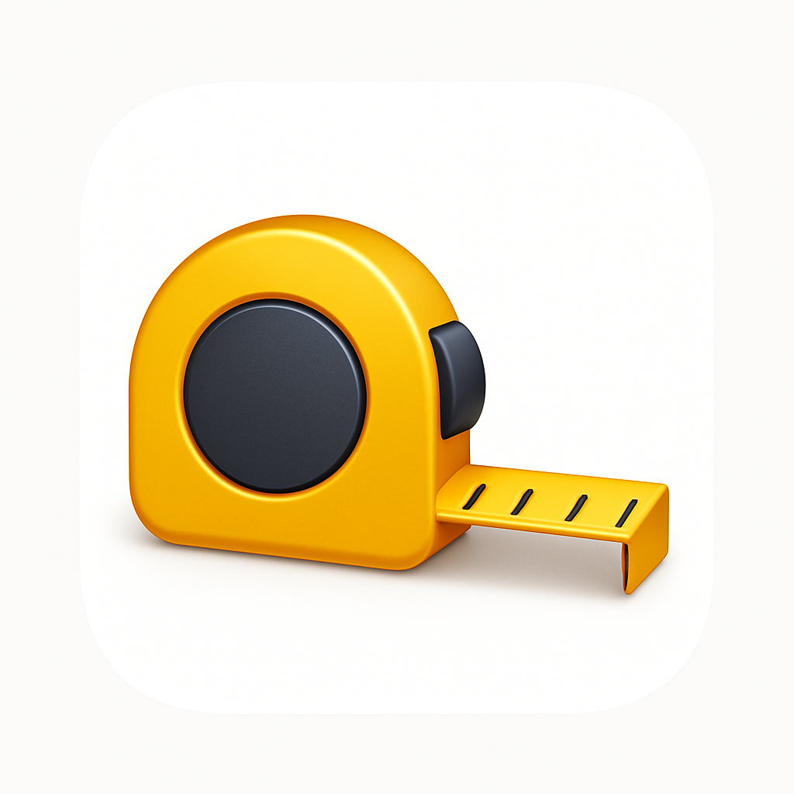
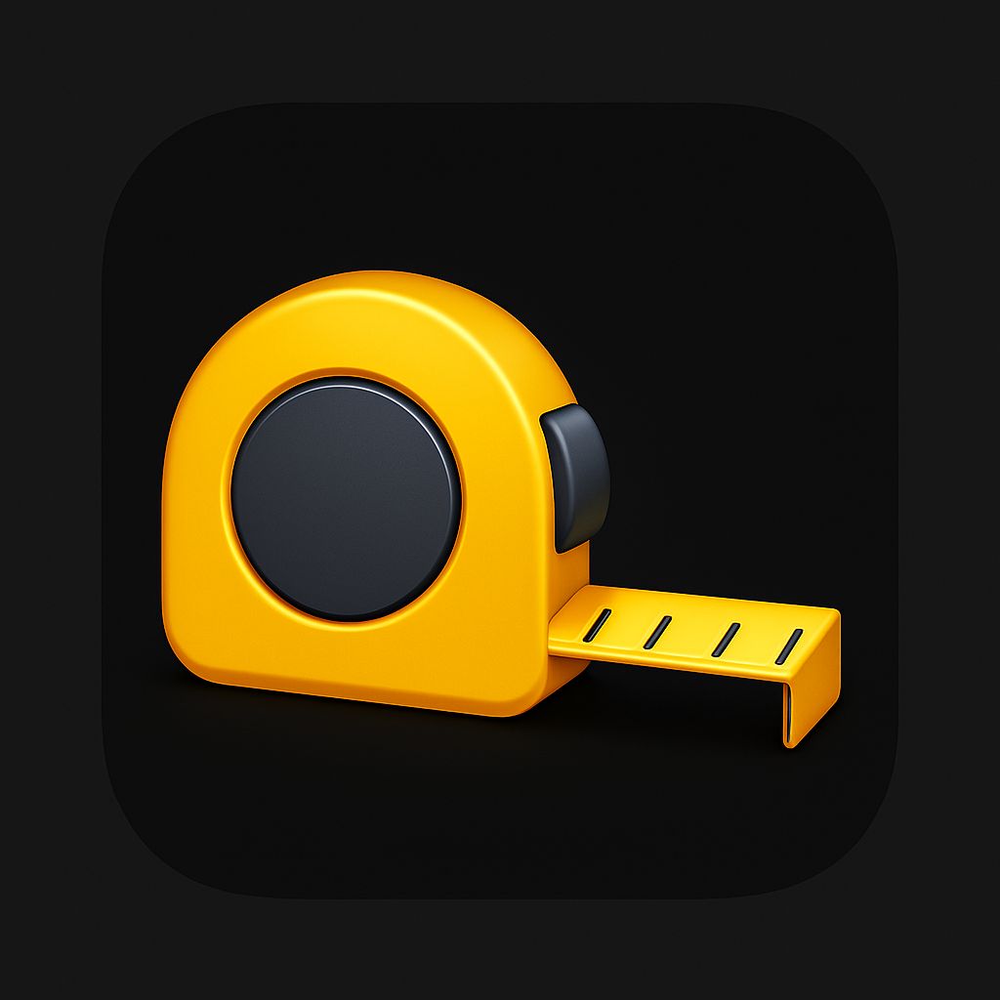

# Main Features
Rulery is an AR iOS app, built with Swift and ARKit, uses the device’s camera to measure distances between two real-world points. It overlays virtual lines and markers onto the space and calculates the distance through 3D vector math.

# Icon:

  &nbsp;&nbsp;
  

# App Interfaces:

  &nbsp;&nbsp;
  &nbsp;&nbsp;
  

